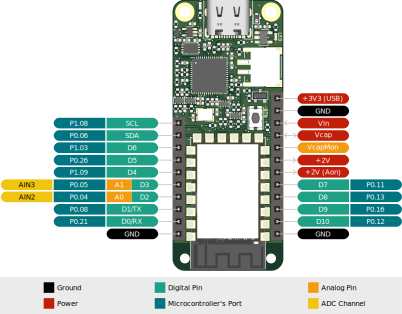

# Riotee Board


Our Riotee Board combines a Riotee Module with a USB Type-C connector and circuitry that facilitates programming and debugging. Two 0.1-inch pin sockets expose all signals from the Riotee module, including 11 GPIOs that support I²C, SPI, and analog sensor applications. You can also use these headers to connect multiple Riotee Shields if you want to extend the capabilities of your device without designing a custom PCB. The Riotee Board has a push button, an LED, and a connector for a solar panel. Once your firmware has been flashed to the board, it will automatically switch over to untethered, battery-free operation.

## Features & Specifications

- 56 x 23 mm board with two 0.1-inch expansion headers for shields
- USB Type-C connector for communicating with a computer
- Raspberry Pi RP2040 controller to handle programming and debugging 
- CMSIS-DAP compatible for programming the Riotee Module via pyOCD or OpenOCD
- Makes UART output from Riotee Module available via USB
- Push button and additional user LED

## Pinout



## Pin Description


| Pad        | Description                                                                         |
|------------|-------------------------------------------------------------------------------------|
| D0/RX      | Digital input/output. Connected to USB-UART on the Board.                           |
| D1/TX      | Digital input/output. Connected to USB-UART on the Board.                           |
| D2/A0      | Digital input/output or analog input.                                               |
| D3/A1      | Digital input/output or analog input.                                               |
| D4         | Digital input/output.                                                               |
| D5         | Digital input/output. Connected to board LED. 1M pulldown.                          |
| D6         | Digital input/output. Connected to push button. 1M pullup.                          |
| D7         | Digital input/output                                                                |
| D8         | Digital input/output.                                                               |
| D9         | Digital input/output.                                                               |
| D10        | Digital input/output.                                                               |
| SCL        | I2C Clock. Connected to AM1805 RTC and MAX20361 boost. Connect I2C devices here.    |
| SDA        | I2C Data. Connected to AM1805 RTC and MAX20361 boost. Connect I2C devices here.     |
| VcapMon    | Buffered capacitor voltage. Use this to measure capacitor voltage with peripherals. |
| Vin        | Harvesting input. Connect a DC voltage between 0.25V and 2.5V.                      |
| Vcap       | Capacitor voltage. Connect additional capacitance to this pin.                      |
| +2V        | Main power supply. Connect peripherals to this pin.                                 |
| +2V (Aon)  | Output of the Buck converter. Not disabled by power switches.                       |
| +3V3       | 3.3V supplied from USB. Only present when USB is connected.                         |
| SwdClk     | ARM Serial Wire Debug (SWD) Clock for programming nRF52.                            |
| SwdIO      | ARM Serial Wire Debug (SWD) I/O for programming nRF52.                              |
| SbwClk     | TI Spy-bi-wire (SBW) Clock for programming MSP430FR.                                |
| SbwIO      | TI Spy-bi-wire (SBW) I/O for programming MSP430FR.                                  |

## Voltage and current ratings

For voltage and current ratings of individual pins please refer to [the module documentation](module_pad_ratings).
## Button

The Board has a push button connected to pin D6 that is pulled high with a 1M resistor.
This leads to an additional current consumption of around 2uA when pin D6 is driven low (default configuration).

## LED

The LED is powered from the USB supply and is controlled with pin D5 via an n-channel mosfet.
The LED only works when the Riotee Board is connected to USB and does not consume energy from the capacitor.
D5 is pulled low with a 1M resistor, leading to an additional current consumption of around 2uA when pin D5 is driven high.

## UART Output

The UART output from pin D1/TX of the Riotee Module is being made available via USB by the RP2040 on the Riotee board.
When connecting the Riotee Board to your computer, a serial port should appear.
Use your favorite terminal application (e.g. minicom on Linux or putty on Windows) to connect to the serial port.
The default baudrate of the UART driver is 1000000bps, but this can be changed via the API.

## Programming

The Riotee Board embeds a {doc}`/hardware/probe` that allows programming and debugging software running on the Riotee Module.

Install the `riotee-probe` Python package with

```bash
pipx install riotee-probe
```

On Linux, install the provided [udev rules](https://github.com/NessieCircuits/Riotee_ProbeSoftware#udev-rules-(linux)) to access the Riotee Board without root privileges.

Flash new firmware with

```bash
riotee-probe program -d nrf52 -f firmware_nrf52.hex
```

and 

```bash
riotee-probe program -d msp430 -f firmware_msp430.hex
```

## Constant Power Supply

The Riotee Board automatically switches on a constant 2V power supply when programming/debugging one of the microcontrollers on the Riotee Module.
You can also permanently enable this constant power supply with

```bash
riotee-probe target-power --on
```

The constant power supply remains enabled while the board is powered from USB or until it is disabled with

```bash
riotee-probe target-power --off
```

## Updating Firmware

Connect a jumper wire from one of the ground pins to the pad labelled 'USB_BOOT' on the bottom of the board, while plugging in the USB cable.
A removable storage drive should appear on your PC.
Download the latest firmware (*probe_riotee_board_[version].uf2*) from the [release page](https://github.com/NessieCircuits/Riotee_ProbeSoftware/releases/latest) and drop it into the drive.

## Debugging

Refer to the Refer to the {doc}`/debugging` section.

## Resources
 - [Schematics](https://www.riotee.nessie-circuits.de/artifacts/board/latest/schematics.pdf)
 - [Layout](https://www.riotee.nessie-circuits.de/artifacts/board/latest/pcb.pdf)
 - [Assembly plan](https://www.riotee.nessie-circuits.de/artifacts/board/latest/assembly.pdf)
 - [3D rendering](https://www.riotee.nessie-circuits.de/artifacts/board/latest/3drendering.png)