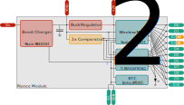
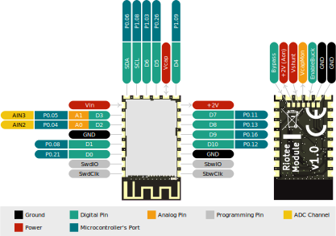

# Riotee Module

Our Riotee Module is the heart of the product line. It integrates energy harvesting, energy storage, power management, non-volatile memory, a powerful Cortex-M4 processor, and a 2.4-GHz, BLE-compatible radio into a tiny module with the footprint of a postage stamp. The Module can be soldered onto a PCB with any standard soldering iron or by reflow soldering. Thanks to the standard 0.1" pitch, it's also possible to mount some pin headers and plug the Module into a breadboard.



A Maxim MAX20361 boost charger regulates the voltage of an attached harvester using Maximum Power Point tracking and charges the on-board capacitors. The boost converter can be configured over an I2C interface. The buck regulator outputs a constant 2V supply voltage. Two independent comparators continuously monitor the capacitor voltage against two software-controlled voltage thresholds.

The module has two microcontrollers: The Nordic Semiconductor nRF52833 has a 64-MHz Cortex-M4 CPU with floating point unit and a low-power 2.4GHz wireless radio. The TI MSP430FR5962 has 128kB non-volatile FRAM. Both controllers can be programmed by the user and share access to all other components of the system. For example, the buffered capacitor voltage is available on the ADC inputs of both controllers. The controllers are connected to each other with a 4-wire SPI bus plus an additional handshake line. This system architecture supports different configurations: The software provided by the Riotee SDK runs application and networking code on the nRF52833 microcontroller and uses the MSP430FR as an SPI-based non-volatile RAM to retain application state across power outages. Other users may prefer running application code directly on the MSP430FR controller and using the nRF52833 as an SPI-controlled radio.

## Features & Specifications

- 15.2 x 27.18 x 2.5mm, breadboard-friendly module with 11 GPIOs (2 with analog sensing)
- SPI, I²C, UART, PWM, and I²S can be flexibly mapped to any of the GPIOs
- 64-MHz ARM Cortex-M4F CPU with floating-point unit (Nordic nRF52833)
- 16MHz TI MSP430 microcontroller with 128kB non-volatile FRAM memory
- Low-power, 2.4-GHz radio
- Boost converter with software-defined [maximum power point tracking](https://en.wikipedia.org/wiki/Maximum_power_point_tracking) 
- Sensing of capacitor voltage, harvesting voltage, and harvesting current
- Software-defined thresholds to enable and disable capacitor-based power
- 66 uF expandable on-board capacitance
- 2 V regulated output voltage
- Additional capacitor backup powers RTC in the absence of a power supply (may last for seconds or minutes depending on conditions)
- Onboard LED

## Pinout



## Pin Description

| Pad        | Description                                                                         |
|------------|-------------------------------------------------------------------------------------|
| D0         | Digital input/output.                                                               |
| D1         | Digital input/output.                                                               |
| D2/A0      | Digital input/output or analog input.                                               |
| D3/A1      | Digital input/output or analog input.                                               |
| D4         | Digital input/output.                                                               |
| D5         | Digital input/output.                                                               |
| D6         | Digital input/output.                                                               |
| D7         | Digital input/output                                                                |
| D8         | Digital input/output.                                                               |
| D9         | Digital input/output.                                                               |
| D10        | Digital input/output.                                                               |
| SCL        | I2C Clock. Connected to AM1805 RTC and MAX20361 boost. Connect I2C devices here.    |
| SDA        | I2C Data. Connected to AM1805 RTC and MAX20361 boost. Connect I2C devices here.     |
| VcapMon    | Buffered capacitor voltage. Use this to measure capacitor voltage with peripherals. |
| Vin        | Harvesting input. Connect a DC voltage between 0.25V and 2.5V.                      |
| Vcap       | Capacitor voltage. Connect additional capacitance to this pad.                      |
| +2V        | Main power supply. Connect peripherals to this pad.                                 |
| +2V (Aon)  | Output of the Buck converter. Not disabled by power switches.                       |
| Vshunt     | Supply voltage behind power switch. Measure current between +2V (Aon) and this pad. |
| Bypass     | Bypass enable. Set pad high to enable power switch for current measurement.         |
| EnableBuck | Enable/Disable buck regulator. Use this when not using MAX20361 boost regulator.    |
| SwdClk     | ARM Serial Wire Debug (SWD) Clock for programming nRF52.                            |
| SwdIO      | ARM Serial Wire Debug (SWD) I/O for programming nRF52.                              |
| SbwClk     | TI Spy-bi-wire (SBW) Clock for programming MSP430FR.                                |
| SbwIO      | TI Spy-bi-wire (SBW) I/O for programming MSP430FR.                                  |

The nRF52 allows flexbily mapping most of the peripherals to any of the pins.

(module_pad_ratings)=
## Voltage and current ratings

| Pad        | Rating                                                 |
|------------|--------------------------------------------------------| 
| D0-D10     | Max voltage 2.0V, Max output current 4mA.*             |
| A0-A1      | Max voltage 2.0V, Max output current 4mA.*             |
| +2V        | Max output current 500mA.                              |
| +2V (Aon)  | Max output current 500mA.                              |
| Vin        | Max voltage 3.5V, Harvesting voltage range 225mV-2.5V. |
| EnableBuck | Connect to ground or leave floating.                   |
| Bypass     | Max voltage 5.0V.                                      |
| VcapMon    | Max output current 10mA.                               |
| Vcap       | Max voltage 4.7V.                                      |

*The GPIO pins of the nRF52 are specified to drop by less than 0.4V below the supply voltage at a maximum current output of 4mA. Configuring the GPIOs for *high drive* mode increases the current rating to 14mA at a 0.4V voltage drop. Refer to the product specificiation for more details.

The total current out of or into all GPIO pins at any time should not exceed 15mA.

## Internal Pin Map

Most signals on the Riotee Module are shared between the MSP430 and the nRF52 so either of the two controllers can access the peripherals like RTC, boost converter and threshold network.
Additionally, the two controllers are connected with five signals, supporting 4-wire SPI plus an additional handshake line.
The table below shows the complete signal mapping on the Riotee Module.


| Signal     | Pin MSP430 | Pin nRF52 | Description                                            |
|------------|------------|-----------|--------------------------------------------------------|
| D0         | P2.6       | P0.21     | Digital input/output.                                  |
| D1         | P2.5       | P0.08     | Digital input/output.                                  |
| D2/A0      | P2.3       | P0.04     | Digital input/output or analog input.                  |
| D3/A1      | P2.4       | P0.05     | Digital input/output or analog input.                  |
| D4         | P4.6       | P1.09     | Digital input/output.                                  |
| D5         | P3.6       | P0.26     | Digital input/output.                                  |
| D6         | PJ.6       | P1.03     | Digital input/output.                                  |
| D7         | P5.3       | P0.11     | Digital input/output.                                  |
| D8         | P5.2       | P0.13     | Digital input/output.                                  |
| D9         | P5.1       | P0.16     | Digital input/output.                                  |
| D10        | P5.0       | P0.12     | Digital input/output.                                  |
| C2C.GPIO   | PJ.2       | P0.15     | GPIO signal between MSP430 and nRF52.                  |
| C2C.COPI   | P2.0       | P0.17     | SPI COPI between MSP430 and nRF52.                     |
| C2C.CIPO   | P2.1       | P0.14     | SPI CIPO between MSP430 and nRF52.                     |
| C2C.CLK    | P1.5       | P0.18     | SPI SCK between MSP430 and nRF52.                      |
| C2C.CS     | P1.4       | P0.22     | SPI CS between MSP430 and nRF52.                       |
| SYS.SDA    | P6.4       | P0.06     | I2C Clock. Connected to AM1805 RTC and MAX20361 boost. |
| SYS.SCL    | P6.5       | P1.08     | I2C Data. Connected to AM1805 RTC and MAX20361 boost.  |
| MAX_INT    | PJ.1       | P0.25     | MAX20361 boost converter interrupt signal.             |
| LED_CTRL   | PJ.0       | P0.03     | Controls LED. Active high.                             |
| VCAP_SENSE | P7.5       | P0.29     | Buffered capacitor voltage.                            |
| RTC_INT    | P7.3       | P0.30     | AM1805 RTC interrupt signal.                           |
| PWRGD_L    | P5.4       | P0.23     | Low threshold indicator.                               |
| PWRGD_H    | P5.5       | P0.07     | High threshold indicator.                              |
| THRCTRL.L0 | P6.2       | P1.07     | Controls low threshold resistor network.               |
| THRCTRL.L1 | P7.0       | P1.04     | Controls low threshold resistor network.               |
| THRCTRL.H0 | P1.3       | P0.09     | Controls high threshold resistor network.              |
| THRCTRL.H1 | P3.3       | P1.02     | Controls high threshold resistor network.              |

## Soldering

The Riotee Module can be soldered onto a PCB manually or in an automated reflow process.
For reflow soldering, we recommend a standard lead free process with a peak temperature of 260° Celsius.
The pads on the bottom of the module can only be connected via reflow soldering and require special attention:
If applying paste with a stencil, use a stencil with a thickness of at least 100um, preferably more.
When using a solder paste printer, you may need to increase the default amount of paste for these pads by up to 50%.

## Programming

For programming the nRF52 and MSP430FR on-board the module, use the {doc}`/hardware/probe`.
Connect ground and *VccTarget* on the probe to *+2V* on the Riotee Module.
For programming the nRF52, connect *SwdClk* and *SwdIO* between the probe and the module.
For programming the MSP430, connect *SbwClk* and *SbwIO* between the probe and the module.

Install the `riotee-probe` Python package with

```bash
pipx install riotee-probe
```

Flash new firmware with

```bash
riotee-probe program -d nrf52 -f firmware_nrf52.hex
```

and 

```bash
riotee-probe program -d msp430 -f firmware_msp430.hex
```

## Debugging

Refer to the {doc}`/debugging` section.

## LED

The Riotee Module has a red LED connected to *P0.03* of the nRF52 and *PJ.0* of the MSP430FR.
Set the pin high to switch on the LED.

## Capacitor Voltage Monitoring

The capacitor voltage is divided down with a voltage divider and made available to the system via an op-amp buffer as *VcapMon*.

```{math}
VcapMon=\frac{5.62}{15.62}Vcap
```

*VcapMon* is connected to ADC channel AIN5 on the nRF52 and ADC channel A17 on the MSP430.

## Power Switches

```{image} img/power_switches.svg
:width: 50%
:align: center
```

There are two power switches between the output of the buck regulator and the other parts of the system.
One switch is controlled by the *Bypass* signal and allows rerouting current through an external amperemeter to measure the dynamic power consumption of the module.
When setting high pin *Bypass*, the switch opens and current can be measured with an amperemeter connected between *+2V (Aon)* and *Vshunt*.
See also [here](measuring_current).

The other switch is controlled by the AM1805 RTC.
It allows entering an ultra-low power mode where all components are switched off except for the RTC.
This reduces current consumption on the +2V supply to <45nA.
For details, refer to the [AM1805 datasheet](https://www.solid-run.com/wiki/lib/exe/fetch.php?media=imx8:carrierboard:docs:sr-imx8m-carrierboard-onboard-rtc.pdf).


## Resources
 - [3D step model](https://github.com/NessieCircuits/Riotee_Module/blob/main/RioteeModule.step)
 - [KiCad schematic symbol](https://github.com/NessieCircuits/Riotee_Module/blob/main/RioteeModule.kicad_sym)
 - [KiCad footprint](https://github.com/NessieCircuits/Riotee_Module/blob/main/RioteeModule.pretty)