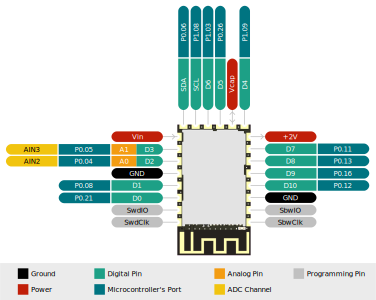

# Riotee Module

Our Riotee Module is the heart of the product line. It integrates energy harvesting, energy storage, power management, non-volatile memory, a powerful Cortex-M4 processor, and a 2.4-GHz, BLE-compatible radio into a tiny module with the footprint of a postage stamp. The Module can be soldered onto a PCB with any standard soldering iron or by reflow soldering. Thanks to the standard 0.1" pitch, it's also possible to mount some pin headers and plug the Module into a breadboard.

A Maxim MAX20361 boost charger regulates the voltage of an attached harvester using Maximum Power Point tracking and charges the on-board capacitors. The boost converter can be configured over an I2C interface. The buck regulator outputs a constant 2V supply voltage. Two independent comparators continuously monitor the capacitor voltage against two software-controlled voltage thresholds.

The module has two microcontrollers: The Nordic Semiconductor nRF52833 has a 64-MHz Cortex-M4 CPU with floating point unit and a low-power 2.4GHz wireless radio. The TI MSP430FR5962 has 128kB non-volatile FRAM. Both controllers can be programmed by the user and share access to all other components of the system. For example, the buffered capacitor voltage is available on the ADC inputs of both controllers. The controllers are connected to each other with a 4-wire SPI bus plus an additional handshake line. This system architecture supports different configurations: The software provided by us runs application and networking code on the nRF52833 microcontroller and uses the MSP430FR as an SPI-based non-volatile RAM to retain application state across power outages. Other users may prefer running application code directly on the MSP430FR controller and using the nRF52833 as an SPI-controlled radio.

## Features & Specifications

- 15.2 x 27.18 x 2.5mm, breadboard-friendly module with 11 GPIOs (2 with analog sensing)
- SPI, I²C, UART, PWM, and I²S can be flexibly mapped to any of the GPIOs
- 64-MHz ARM Cortex-M4F CPU with floating-point unit (Nordic nRF52833)
- 16MHz TI MSP430 microcontroller with 128kB non-volatile FRAM memory
- Low-power, 2.4-GHz radio
- Boost converter with software-defined [maximum power point tracking](https://en.wikipedia.org/wiki/Maximum_power_point_tracking) 
- Sensing of capacitor voltage, harvesting voltage, and harvesting current
- Software-defined thresholds to enable and disable capacitor-based power
- 80 uF expandable on-board capacitance
- 2 V regulated output voltage
- Additional capacitor backup powers RTC in the absence of a power supply (may last for seconds or minutes depending on conditions)
- Onboard LED

## Pinout

## Resources
 - [3D step model](https://github.com/NessieCircuits/Riotee_Module/blob/main/RioteeModule.step)
 - [KiCad schematic symbol](https://github.com/NessieCircuits/Riotee_Module/blob/main/RioteeModule.kicad_sym)
 - [KiCad footprint](https://github.com/NessieCircuits/Riotee_Module/blob/main/RioteeModule.pretty)