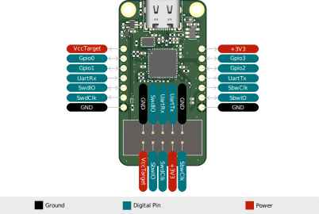

# Riotee Probe

Programming battery-free devices is tricky. The power from a harvester is generally insufficient to support programming. Furthermore, the additional current consumption and the leakage through the programming pins can interfere with the behavior of a battery-free device. But connecting the device to a constant power supply prevents observing its *real* behavior. For many years, our solution to this problem was to attach the device to a power supply and programmer, flash the software, remove the power supply and the programmer, test the new firmware, connect the wires again and so on. This is inconvenient and frustrating when you're chasing a bug.

With the Riotee Probe the process becomes much easier: When programming/debugging is requested, the Probe automatically switches on a constant power supply and supplies the microcontrollers on the Riotee Module throughout the transfer. After programming, the power supply as well as the programming pins are automatically disconnected from the Riotee Module with analog switches. The device returns to harvesting operation and you can immediately observe the new software without interference from the programming dongle.

The Riotee Probe supports programming both, the MSP430 and the nRF52 on the Riotee Module after you've soldered it onto your PCB or plugged it into a breadboard. It has a standard, 10-pin, 0.1-inch connector and is compatible with Tag-Connect cables that support in-circuit debugging.

Additionally, the Riotee Probe has four GPIOs that can be controlled via USB from the CLI or API interfaces. This allows, for example, building test jigs to automatically program and test your Riotee-based devices.

## Features & Specifications

- Custom debug probe for in-circuit programming and debugging of Riotee Modules
- USB Type-C connector for communicating with a computer
- Raspberry Pi RP2040 controller handles programming and debugging
- CMSIS-DAP compatible for programming the Riotee Module via pyOCD or OpenOCD
- Makes UART output from Riotee module available via USB

## Software

The [Riotee Probe software](https://github.com/NessieCircuits/Riotee_ProbeSoftware) consists of two parts:
The *firmware* is running on the RP2040 on-board the Riotee Probe and exposes a USB interface for interfacing with the Riotee Module via UART, ARM SWD and TI SBW.
The *Python package* runs on a computer and offers a CLI and API that talks to the Riotee Probe over USB.

For installation and usage instructions, refer to the [repository's readme](https://github.com/NessieCircuits/Riotee_ProbeSoftware).

## Pinout



## Pin Description

| Pin       |                                                                                 |
|-----------|---------------------------------------------------------------------------------|
| Gpio0     | General purpose Input/Output. Can be controlled via CLI/API.                    |
| Gpio1     | General purpose Input/Output. Can be controlled via CLI/API.                    |
| Gpio2     | General purpose Input/Output. Can be controlled via CLI/API.                    |
| Gpio3     | General purpose Input/Output. Can be controlled via CLI/API.                    |
| UartTx    | UART data sent from a PC via USB to the Riotee device. Not yet implemented.     |
| UartRx    | UART data sent from the Riotee device to a computer.                            |
| SwdClk    | ARM Serial Wire Debug Clock for programming nRF52 on the Riotee Module.         |
| SwdIO     | ARM Serial Wire Debug I/O for programming nRF52 on the Riotee Module.           |
| SbwClk    | TI Spy-bi-wire Clock for programming MSP430FR on the Riotee Module.             |
| SbwIO     | TI Spy-bi-wire I/O for programming MSP430FR on the Riotee Module.               |
| +3V3      | Auxiliary +3.3V power supply.                                                   |
| VccTarget | Target power supply. Enabled during programming. Can be controlled via CLI/API. |

(constant_power_supply)=
## Constant Power Supply

The Riotee Probe automatically switches on a constant 2V power supply on the *VccTarget* pin when programming/debugging one of the microcontrollers on the Riotee Module.
You can also permanently enable this constant power supply with

```bash
riotee-probe target-power --on
```

The constant power supply remains enabled while the probe is powered or until it is disabled with

```bash
riotee-probe target-power --off
```

## Resources
 - [Schematics](https://www.riotee.nessie-circuits.de/artifacts/probe_hardware/latest/schematics.pdf)
 - [Layout](https://www.riotee.nessie-circuits.de/artifacts/probe_hardware/latest/pcb.pdf)
 - [Assembly plan](https://www.riotee.nessie-circuits.de/artifacts/probe_hardware/latest/assembly.pdf)
 - [3D rendering](https://www.riotee.nessie-circuits.de/artifacts/probe_hardware/latest/3drendering.png)
 - [Software](https://github.com/NessieCircuits/Riotee_ProbeSoftware)
