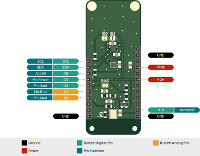

# Riotee Sensor Shield

Our Sensor Shield adds an accelerometer, a temperature-and-humidity sensor, and a microphone to your Riotee device.

Sensors:
- Bosch BMA400 digital accelerometer
- Sensirion SHTC3 digital temperature and humidity sensor
- Vesper VM1010 analog microphone with power switch

## Low power operation

To minimize the power consumption of the shield, disable the microphone by setting high pin D5 and put the SHTC3 into sleep mode with `shtc3_init()` in the `startup_callback()` and whenever not needed.

For an example, take a look at the [VM1010 example](https://github.com/NessieCircuits/Riotee_SDK/tree/main/examples/vm1010).

## Microphone bias voltage

The analog output of the microphone is developed with respect to a 800mV offset voltage and swings often just a few millivolts for low sound levels.
To enable measuring these small voltage swings, the sensor shield has an 810mV bias voltage output.
Configuring the ADC in differential mode and measuring the output voltage with respect to this bias voltage significantly increases the resolution and may also reduce noise that gets coupled in on the way from the shield to the ADC.

Due to the design of the bias voltage circuit, it takes around 4ms for the bias voltage to reach 99% of its value after the microphone is enabled via pin D5.

## Pinout

## Pin description

| Pin      | Description                                                                                 |
|----------|---------------------------------------------------------------------------------------------|
| SCA      | I2C clock. Connected to accelerometer and T&H sensor.                                       |
| SDA      | I2C clock. Connected to accelerometer and T&H sensor.                                       |
| AccInt   | Accelerometer interrupt line.                                                               |
| MicPower | Enables microphone power. Active low. 1M on-board pull-up.                                  |
| MicDout  | Microphone digital output. Active high on detected sound.                                   |
| MicBias  | 810mV bias voltage for differential ADC.                                                    |
| MicAout  | Microphone analog output.                                                                   |
| MicMode  | Microphone mode select. High selects Wake-on-sound mode.                                    |
| +2V      | Board power supply.                                                                         |
| Vcap     | Capacitor voltage. Increase capacity by mounting an additional SMD capacitor on the shield. |

## Resources
 - [Schematics](https://www.riotee.nessie-circuits.de/artifacts/sensor_shield/latest/schematics.pdf)
 - [Layout](https://www.riotee.nessie-circuits.de/artifacts/sensor_shield/latest/pcb.pdf)
 - [3D rendering](https://www.riotee.nessie-circuits.de/artifacts/sensor_shield/latest/3drendering.png)
